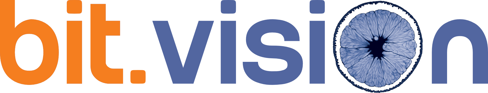

<div align="center">



# bitvision phoenix

<!-- project / repo -->
[](./LICENSE)
[](https://github.com/angleto/bitvision/actions/workflows/ci.yml)
[](https://github.com/angleto/bitvision/actions/workflows/openapi-check.yml)
[](https://github.com/angleto/bitvision/commits/v3.10)
[](./CHANGELOG.md)

<!-- stack -->
[](./backend)
[](./backend)
[](./frontend)
[](./frontend)
[](./infra)
[](./mcp)

<!-- quality / contribution -->
[](https://github.com/astral-sh/ruff)
[](https://biomejs.dev)
[-brightgreen)](./CONTRIBUTING.md)
[](./SECURITY.md)
[](./NOTICE)

</div>

A free, open-source web platform for uploading, searching, viewing and
annotating DICOM medical imaging — with LLMs as first-class citizens.

Rewrite of the original bitvision DICOM search engine (2012-2015), now
built on a modern stack: FastAPI, PostgreSQL + pgvector, S3-compatible
object storage, OHIF viewer, native MCP server.

> Status: beta. Public OSS release 2026-05-19; v3.10 line in active
> development. See [CHANGELOG.md](./CHANGELOG.md) for the per-version
> history and [DESIGN.md](./docs/DESIGN.md) for the architecture and
> roadmap.

> ⚠️ **Not a medical device.** bitvision phoenix is **not** CE/MDR or
> FDA certified and **must not** be used for diagnosis, treatment, or
> any clinical decision-making. It is intended for personal
> health-record use, research and education only, and is provided
> "as is" without warranty. The operator is solely responsible for
> GDPR and local health-data compliance. See [NOTICE](./NOTICE) and
> [SECURITY.md](./SECURITY.md).

## Quick links

- [DESIGN.md](./docs/DESIGN.md) — architecture, data model, roadmap, open questions
- [docs/authorization.md](./docs/authorization.md) — ownership, sharing, permissions
- [docs/sharing.md](./docs/sharing.md) — link-based sharing, presets, JWT scoped a grant
- [docs/fascicolo.md](./docs/fascicolo.md) — patient electronic record (FSE 2.0 inspired)
- [docs/agent-protocols.md](./docs/agent-protocols.md) — MCP + A2A agent communication protocols
- `LICENSE` — [GNU AGPL-3.0](./LICENSE)

## Core capabilities (summary)

- User-driven DICOM upload (no hospital PACS integration)
- Metadata + tag + vector similarity search (BiomedCLIP embeddings)
- Advanced in-browser viewer (2D, MPR, 3D volume rendering)
- Human and LLM annotations (clearly distinguished)
- Patient radiology record (fascicolo, FSE 2.0 inspired)
- Virtual Organizations for structured data sharing
- Anonymous access to public demo datasets
- REST API + native MCP server (read + write tool families across
  patients, studies, search, sharing, documents, care phases,
  segmentations, ...; the registry lives under
  [`mcp/src/bvmcp/tools/`](./mcp/src/bvmcp/tools/) and is documented in
  [`docs/agent-protocols.md`](./docs/agent-protocols.md))
- A2A protocol for autonomous doctor-agent communication

## Development

See [CONTRIBUTING.md](./CONTRIBUTING.md) for setup and conventions.

```sh
cp .env.example .env
make up               # infra (postgres+pgvector, redis, minio, authentik)
make backend.install
make backend.dev      # API on http://localhost:8000 (docs at /docs)
make frontend.install
make frontend.dev     # UI on http://localhost:3000
```

Run `make help` for the full task list.

## Services

- [`backend/`](./backend) — FastAPI REST API
- [`workers/`](./workers) — Arq async workers (DICOM ingestion, embeddings, LLM jobs)
- [`crawler/`](./crawler) — admin CLI for public DICOM archives
- [`mcp/`](./mcp) — native Model Context Protocol server for LLM/agent clients
- [`frontend/`](./frontend) — Next.js + OHIF viewer
- [`infra/`](./infra) — docker-compose + Dockerfiles

The roadmap is in [DESIGN.md §8](./docs/DESIGN.md).
